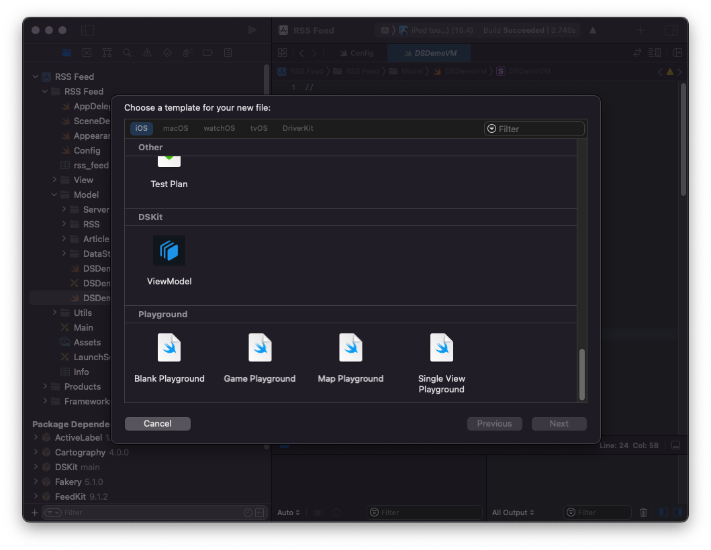

# Custom DSKit view models

Using `DSKit` you can add and display your own custom view models.
A view model is composed of two files, the ViewModel struct which should conform to `DSViewModel`, `Equatable`, `Hashable` protocols, and the View class which is a subclass of `UIView` and should implement the `DSReusableUIView` protocol.

## Template

The easiest way to create new view models with everything you need to be configured is to use ready to use XCode template.

It can be installed in two ways:
1. Manually copy `ViewModel.xctemplate`from `dskit/Templates/ViewModelTemplates` to `Xcode.app/Contents/Developer/Library/Xcode/Templates/File Templates`
2. Run script from terminal, open `/dskit/Templates/ViewModelTemplates`in terminal and run `sudo sh install.sh`

    

