## DSVStack

`DSVStack` is a SwiftUI component within the DSKit framework designed to layout child views vertically with customizable spacing and alignment. It enhances the standard `VStack` by integrating design system themes and spacing guidelines.

#### Initialization:
Initializes a `DSVStack` with alignment, spacing, and dynamic content.
- Parameters:
- `alignment`: The horizontal alignment of content within the stack. Defaults to `.leading`.
- `spacing`: Specifies the space between each item within the stack. Defaults to `.regular`.
- `content`: A `@ViewBuilder` closure that generates the content of the stack.

#### Usage:
`DSVStack` is particularly useful for creating layouts where vertical arrangement of components is required, maintaining consistency with the design system’s spacing and alignment guidelines.
#### Code example:
Here is how you might set up it within your views:
```swift
struct Testable_DSVStack: View {
    var body: some View {
        DSHStack {
            DSVStack(spacing: .small) {
                Color.yellow
                Color.green
                Color.blue
            }.overlay(alignment: .center, content: { Text("1") })
            DSVStack(spacing: .regular) {
                Color.yellow
                Color.green
                Color.blue
            }.overlay(alignment: .center, content: { Text("2") })
            DSVStack(spacing: .medium) {
                Color.yellow
                Color.green
                Color.blue
            }.overlay(alignment: .center, content: { Text("3") })
        }.dsHeight(300)
    }
}
```
Code example result:

<table><tr><td>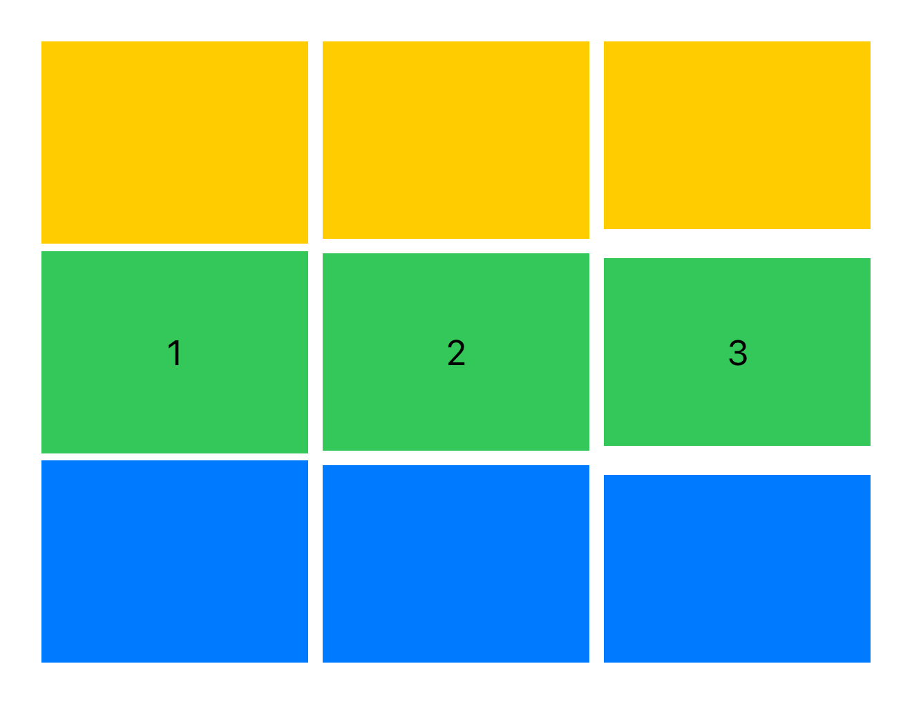</td></tr><table/>


## DSHStack

`DSHStack` is a SwiftUI component designed to lay out child views in a horizontal line within the DSKit framework. It extends SwiftUI's `HStack` but includes additional design system specifications such as spacing adjustments based on the current appearance settings.

#### Initialization:
Initializes a `DSHStack` with alignment, spacing, and dynamic content.
- Parameters:
- `alignment`: The vertical alignment of content within the stack. Defaults to `.center`.
- `spacing`: Specifies the space between each item within the stack. Defaults to `.regular`.
- `content`: A `@ViewBuilder` closure that generates the content of the stack.

#### Usage:
`DSHStack` is particularly useful for creating layouts where horizontal arrangement of components is required, maintaining consistency with the design system’s spacing and alignment guidelines.
#### Code example:
Here is how you might set up it within your views:
```swift
struct Testable_DSHStack: View {
    var body: some View {
        DSVStack {
            DSHStack(spacing: .small) {
                Color.yellow
                Color.green
                Color.blue
            }.overlay(alignment: .center, content: { Text("2") })
            DSHStack(spacing: .regular) {
                Color.yellow
                Color.green
                Color.blue
            }.overlay(alignment: .center, content: { Text("3") })
            DSHStack(spacing: .medium) {
                Color.yellow
                Color.green
                Color.blue
            }.overlay(alignment: .center, content: { Text("4") })
        }.dsHeight(300)
    }
}
```
Code example result:

<table><tr><td>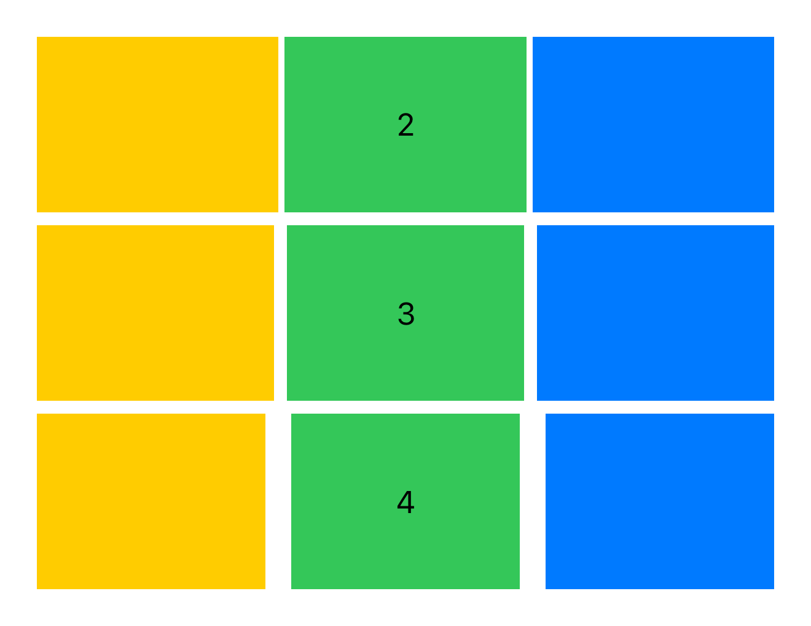</td></tr><table/>


 ## DSGrid

`DSGrid` is a flexible and customizable grid component within the DSKit framework, designed to display collections of data in a grid layout. It is adaptable to various content types and layouts, making it an essential tool for creating responsive and aesthetically pleasing UIs.

#### Initialization:
Initializes `DSGrid` with customizable settings for layout and data handling.
- Parameters:
- `viewHeight`: Optional height for each item, allowing for uniform or dynamic row heights.
- `numberOfColumns`: The number of columns in the grid, defaulting to 2.
- `spacing`: Spacing between grid items, with a default setting.
- `data`: The collection of data items to display.
- `id`: KeyPath to the unique identifier for each data item.
- `content`: Closure that returns a `Content` view for each data item.

#### Usage:
`DSGrid` can be used in various applications, from displaying photos in a gallery to creating a product list in an e-commerce app.
#### Code example:
Here is how you might set up it within your views:
```swift
struct Testable_DSGrid: View {
    let colors = [Color.red, Color.green, Color.yellow, Color.purple, Color.red]
    var body: some View {
        DSGrid(
            viewHeight: 50,
            numberOfColumns: 3,
            data: colors,
            id: \.self,
            content: { color in
                color
            }
        )
    }
}
```
Code example result:

<table><tr><td></td></tr><table/>


## DSButton

`DSButton` is a highly customizable button component in the DSKit framework, designed to accommodate various styles and use cases within the application. It supports several predefined styles as well as custom configurations, making it versatile for different interface needs.

#### Styles:
`DSButton` offers multiple styles to cater to different UI requirements:
- `default`: Standard button style.
- `light`: A lighter version of the button, typically for less emphasis.
- `borderedLight`: A light button with a border.
- `custom(color: Color)`: Allows for a custom color to be specified.
- `clear`: A button style without a background.

#### Initializers:
Multiple initializers allow for various configurations of the button, supporting images, custom spacing, and push-to-sides behavior:
- Parameters:
- `title`: The text to be displayed on the button.
- `leftImage`: Optional image to show on the left side of the text.
- `rightImage`: Optional image to show on the right side of the text.
- `pushContentToSides`: If true, pushes the content to the sides of the button.
- `style`: The style of the button, from the predefined styles or custom.
- `maxWidth`: A boolean to determine if the button should expand to the maximum available width.
- `spacing`: The spacing to use within the button, particularly between the icon and text.
- `action`: The closure executed when the button is tapped.

#### Customization:
Extensions on `DSButton` provide convenient static methods to create commonly used button configurations:
- `callToActionLink`: Creates a button styled as a call-to-action link.
- `sfSymbol`: Creates a button with an SF Symbol icon, ideal for toolbar or icon-only buttons.
 
#### Usage:
`DSButton` can be used in various parts of the application where user interaction is required. It is capable of handling both text and icons, and can be styled dynamically according to the design requirements.
#### Code example:
Here is how you might set up it within your views:
```swift
struct Testable_DSButton: View {
    var body: some View {
        DSVStack {
            DSVStack(spacing: .small) {
                DSButton(
                    title: "Default",
                    action: { }
                )
                DSButton(
                    title: "Light",
                    style: .light, action: { }
                )
            }
            .dsPadding(.medium)
            .dsSecondaryBackground()
            .dsCornerRadius()
            
            DSVStack {
                DSButton(title: "Default", action: { })
                DSButton(
                    title: "Light",
                    rightSystemName: "message.fill",
                    style: .light,
                    action: { }
                )
                DSButton(
                    title: "Bordered Light",
                    keftSystemName: "message.fill",
                    style: .borderedLight,
                    action: { }
                )
                DSButton(
                    title: "Light",
                    rightSystemName: "message.fill",
                    pushContentToSides: true,
                    style: .light,
                    action: { }
                )
                DSButton(
                    title: "Regular",
                    style: .clear,
                    action: { }
                )
            }
        }
    }
}
```
Code example result:

<table><tr><td>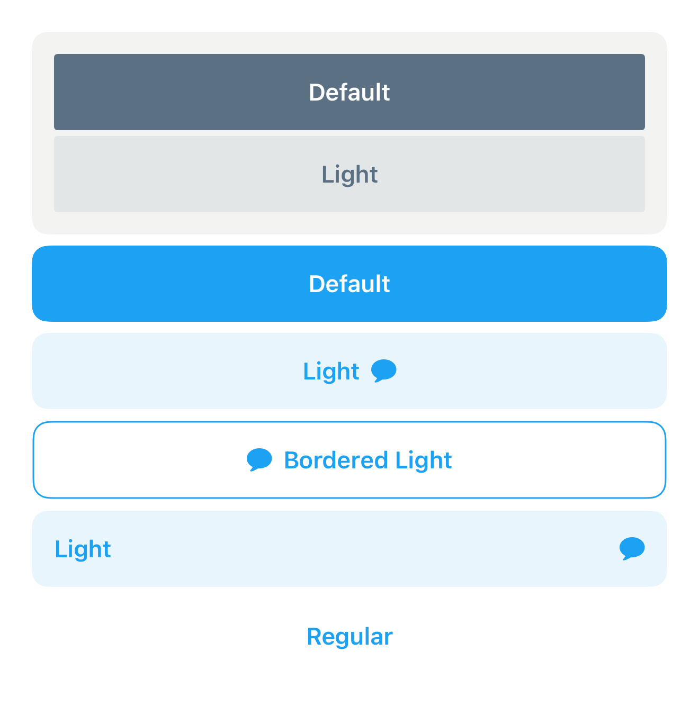</td></tr><table/>


## DSText

`DSText` is a SwiftUI component within the DSKit framework designed to display text with enhanced styling capabilities, allowing for customization according to the design system's guidelines. It integrates seamlessly with environmental settings for appearance and view style to ensure consistency across the application.

#### Initialization:
Initializes a `DSText` with the text content and optional alignment.
- Parameters:
- `text`: The text to be displayed.
- `multilineTextAlignment`: Alignment of the text within the view, defaulting to `.leading`.

#### Usage:
`DSText` is ideal for displaying any textual content where adherence to a design system is required. It supports multiple text styles and configurations, making it versatile for use in titles, body text, captions, and more.
#### Code example:
Here is how you might set up it within your views:
```swift
struct Testable_DSText: View {
    var body: some View {
        DSVStack {
            DSText("Large title").dsTextStyle(.largeTitle)
            DSText("Title 1").dsTextStyle(.title1)
            DSText("Title 2").dsTextStyle(.title2)
            DSText("Title 3").dsTextStyle(.title3)
            DSText("Headline").dsTextStyle(.headline)
            DSText("Headline with size 20").dsTextStyle(.headline, 20)
            DSText("Subheadline").dsTextStyle(.subheadline)
            DSText("Subheadline with size 20").dsTextStyle(.headline, 20)
            DSText("Body").dsTextStyle(.body)
            DSText("Callout").dsTextStyle(.callout)
            DSText("Caption 1").dsTextStyle(.caption1)
            DSText("Caption 2").dsTextStyle(.caption2)
            DSText("Footnote").dsTextStyle(.footnote)
            
            DSHStack {
                DSText(
                    "Lorem Ipsum is simply dummy text.",
                    multilineTextAlignment: .center
                )
                .dsTextStyle(.footnote)
                .border(Color.black, width: 1)
                DSText(
                    "Lorem Ipsum is simply dummy text.",
                    multilineTextAlignment: .leading
                )
                .dsTextStyle(.footnote)
                .border(Color.black, width: 1)
                DSText("Lorem Ipsum is simply dummy text.",
                       multilineTextAlignment: .trailing
                )
                .dsTextStyle(.footnote)
                .border(Color.black, width: 1)
            }
        }
    }
}
```
Code example result:

<table><tr><td>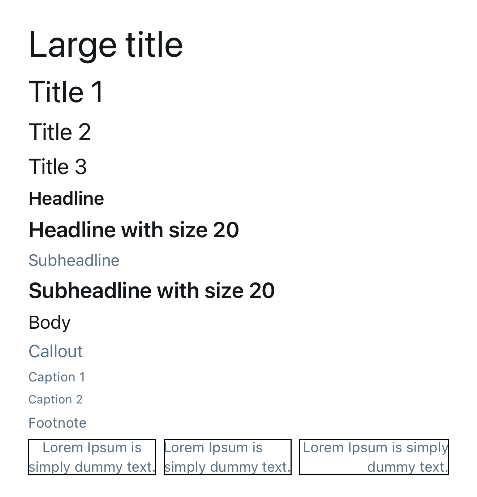</td></tr><table/>


## DSHScroll

`DSHScroll` is a SwiftUI component designed to display a horizontally scrollable view within the DSKit framework. It is ideal for presenting a collection of elements, such as images or cards, in a seamless, scrollable format that extends horizontally.

#### Initialization:
Initializes a `DSHScroll` with parameters that control layout and behavior.
- Parameters:
- `spacing`: Specifies the space between each item within the scroll view.
- `data`: The collection of data items.
- `id`: KeyPath to the unique identifier for each data item.
- `content`: Closure returning a `Content` view for each item in the collection.

#### Usage:
`DSHScroll` is particularly useful in scenarios where users need to browse through a series of items without navigating away from the current view context, such as in a media gallery or a horizontal list of options.
#### Code example:
Here is how you might set up it within your views:
```swift
struct Testable_DSHScroll: View {
    let colors = [
        Color.red,
        Color.green,
        Color.yellow,
        Color.red,
        Color.green,
        Color.yellow
    ]
    var body: some View {
        DSHScroll(spacing: .medium, data: colors, id: \.self) { color in
            color.dsSize(60)
        }
    }
}
```
Code example result:

<table><tr><td>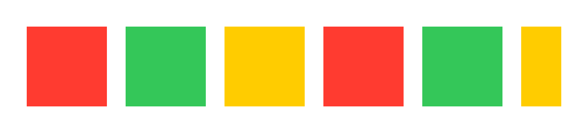</td></tr><table/>


## DSCoverFlow

`DSCoverFlow` is a SwiftUI component that creates a customizable, paginated scroll view. It is designed to display a sequence of views, such as images or cards, in a horizontal scrollable layout. This component is useful for creating cover flow or carousel-like interfaces.

#### Properties:
- `height`: The height of the cover flow view.
- `spacing`: Spacing between each item in the scroll view.
- `showPaginationView`: A Boolean value that indicates whether pagination indicators should be shown.
- `data`: The collection of data that the cover flow will iterate over.
- `content`: A closure that takes a data element and returns a SwiftUI view.
- `id`: A key path to the unique identifier property of each data element.

#### Initialization:
Initializes `DSCoverFlow` with specific layout and behavioral settings.
- Parameters:
- `height`: `DSDimension` specifying the height of the cover flow.
- `spacing`: `DSSpace` specifying the spacing between items.
- `showPaginationView`: Boolean indicating whether to show pagination dots.
- `data`: The collection of data items to display.
- `id`: KeyPath to the unique identifier for each data item.
- `content`: Closure that returns a `Content` view for each data item.
#### Code example:
Here is how you might set up it within your views:
```swift
struct Testable_DSCoverFlow: View {
    
    let colors = [
        UIColor(0x006A7A),
        UIColor(0x28527a),
        UIColor(0xfbeeac)
    ]
    
    var body: some View {
        DSCoverFlow(
            height: 200,
            data: colors,
            id: \.self,
            content: { uiColor in
            uiColor.color
        })
    }
}
```
Code example result:

<table><tr><td>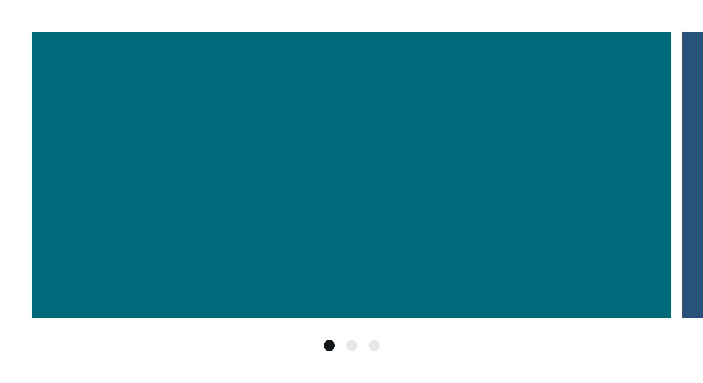</td></tr><table/>


 ## DSImageView

 `DSImageView` is a versatile SwiftUI component within the DSKit framework designed to display images in various formats including system symbols, local images, and remote images. It supports extensive customization options to fit the design system's requirements.
 
 #### Initialization:
 The `DSImageView` can be initialized with various types of image sources:
 - System symbols with optional tinting.
 - Local UI images with optional display shapes and tinting.
 - Remote image URLs with automatic fetching and display.
 - Each initializer configures the view to handle specific image requirements such as scaling, aspect ratio, and shape.

 #### Usage:
 `DSImageView` is ideal for applications requiring diverse image representations, from icons in buttons to profile pictures, and gallery images. Its flexibility makes it suitable for almost any visual representation involving images in a SwiftUI application.
#### Code example:
Here is how you might set up it within your views:
```swift
struct Testable_DSImageView: View {
    
    let imageUrl = URL(string: "https://images.unsplash.com/photo-1702540122576-dd7d387f652f?q=80&w=1932&auto=format&fit=crop&ixlib=rb-4.0.3&ixid=M3wxMjA3fDB8MHxwaG90by1wYWdlfHx8fGVufDB8fHx8fA%3D%3D")
    let testImage = UIImage(
        named: "demo",
        in: Bundle(identifier: "app.DSKit"),
        with: nil
    )
    
    var body: some View {
        DSVStack {
            DSHStack {
                DSImageView(
                    url: imageUrl,
                    style: .circle,
                    size: .size(50)
                )
                DSImageView(
                    url: imageUrl,
                    style: .capsule,
                    size: .size(width: 100, height: 50)
                )
                DSImageView(
                    url: imageUrl,
                    style: .none,
                    size: .size(50)
                )
            }
            
            DSHStack {
                DSImageView(
                    uiImage: testImage,
                    displayShape: .circle,
                    size: .size(50)
                )
                DSImageView(
                    uiImage: testImage,
                    displayShape: .capsule,
                    size: .size(50)
                )
                DSImageView(
                    uiImage: testImage,
                    displayShape: .none,
                    size: .size(width: 100, height: 50)
                )
            }
            
            DSHStack {
                DSImageView(
                    systemName: "sun.rain.fill", 
                    size: .font(.title1),
                    tint: .color(.red)
                )
                DSImageView(
                    systemName: "sun.rain.fill",
                    size: .font(.body),
                    tint: .color(.green)
                )
                DSImageView(
                    systemName: "sun.rain.fill",
                    size: .font(.headline),
                    tint: .color(.blue)
                )
                DSImageView(
                    systemName: "sun.rain.fill",
                    size: .font(.subheadline),
                    tint: .color(.cyan)
                )
            }
        }
    }
}
```
Code example result:

<table><tr><td>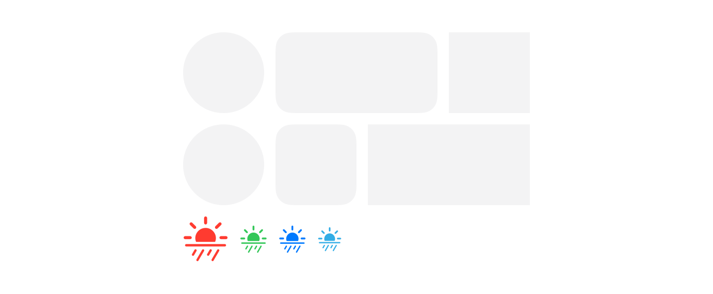</td></tr><table/>


## DSTermsAndConditions

`DSTermsAndConditions` is a SwiftUI component within the DSKit framework designed to display terms and privacy policy information clearly and interactively. It typically includes a preamble message followed by links to the terms of service and privacy policy documents.

#### Initialization:
Initializes a `DSTermsAndConditions` with a specific message.
- Parameters:
- `message`: The text that precedes the links to terms and privacy policy.

#### Usage:
`DSTermsAndConditions` is ideal for registration screens, checkout processes, or any application section where legal agreements or policy acknowledgments are necessary.
#### Code example:
Here is how you might set up it within your views:
```swift
struct Testable_DSTermsAndConditions: View {
    var body: some View {
        DSTermsAndConditions(message: "By pressing confirm order, you agree to our")
    }
}
```
Code example result:

<table><tr><td></td></tr><table/>


## DSPriceView

`DSPriceView` is a customizable view component designed to display price information effectively, accommodating various styles and states such as discounts. It adheres to the design system, responding dynamically to appearance and style settings.

#### Initializer:
Initializes a `DSPriceView` with a given `DSPrice` model, text font key for style, and an optional color.
- Parameters:
- `price`: `DSPrice` struct containing amount, currency, and optional regular amount and discount badge.
- `size`: `DSTextFontKey` indicating the text size and style.
- `color`: Optional `Color` for the price text, defaults to nil.
 
#### Usage:
The `DSPriceView` can display a standard price, a regular (crossed-out) price when a discount is applicable, and an optional discount badge.
#### Code example:
Here is how you might set up it within your views:
```swift
struct Testable_DSPriceView: View {
    let price = DSPrice(
        amount: "100",
        regularAmount: "250",
        currency: "$",
        discountBadge: "10% OFF"
    )
    var body: some View {
        DSPriceView(price: price, size: .title1)
        DSPriceView(price: price, size: .title2)
        DSPriceView(price: price, size: .title3)
        DSPriceView(price: price, size: .headline)
        DSPriceView(price: price, size: .subheadline)
        DSPriceView(price: price, size: .caption1, color: .green)
        DSPriceView(price: price, size: .caption2, color: .green)
        DSPriceView(price: price, size: .footnote)
        DSPriceView(price: price, size: .fontWithSize(.headline, 20))
    }
}
```
Code example result:

<table><tr><td>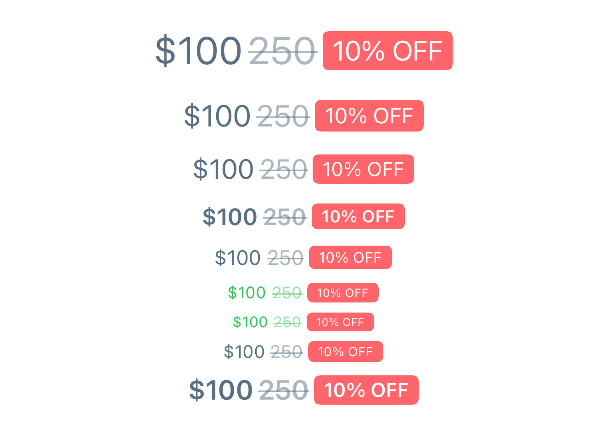</td></tr><table/>


## DSGroupedList

`DSGroupedList` is a SwiftUI component designed to display a collection of data in a grouped list format within the DSKit framework. It organizes elements in a vertical stack with dividers between items, suitable for settings where data needs to be sectioned clearly, such as in menus, forms, or any list-based interface.

#### Initialization:
Initializes a `DSGroupedList` with essential parameters for handling data and custom content rendering.
- Parameters:
- `data`: The collection of data items.
- `id`: KeyPath to the unique identifier for each data item.
- `content`: Closure returning a `Content` view for each item in the data collection.
 
#### Usage:
`DSGroupedList` is particularly effective in environments where distinct visual separation of items is beneficial, enhancing both the organization and aesthetics of list presentations.
#### Code example:
Here is how you might set up it within your views:
```swift
struct Testable_DSGroupedList: View {
    
    let artists = [
        "Eminem",
        "Madona",
        "Michael Jakson"
    ]
    
    var body: some View {
        DSGroupedList(data: artists, id: \.self) { artist in
            DSText(artist)
        }
    }
}
```
Code example result:

<table><tr><td>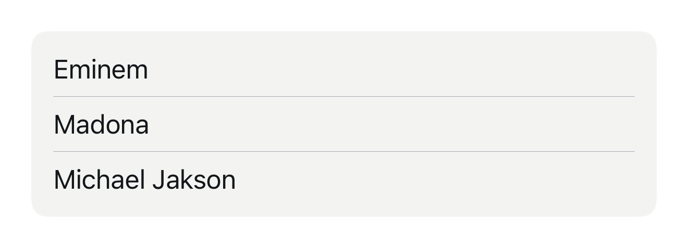</td></tr><table/>


## DSSFSymbolButton

`DSSFSymbolButton` is a SwiftUI component within the DSKit framework designed to create a button with a system symbol icon. This view leverages SwiftUI's SF Symbols to provide a versatile and scalable button that can be used across various parts of an application, ensuring consistency with the design system.

#### Initialization:
Initializes a `DSSFSymbolButton` with a symbol name and size.
- Parameters:
- `name`: The SF Symbol name to use for the button icon.
- `size`: The size of the icon, affecting both the icon's scale and the overall button size.

#### Usage:
`DSSFSymbolButton` is suitable for a wide range of applications where icons are preferred over text for button labels, such as toolbars, navigation bars, or any user interface element requiring concise visual cues.
#### Code example:
Here is how you might set up it within your views:
```swift
struct Testable_DSSFSymbolButton: View {
    var body: some View {
        DSSFSymbolButton(name: "square.stack.3d.down.right", size: 60)
    }
}
```
Code example result:

<table><tr><td></td></tr><table/>


## DSRatingView

`DSRatingView` is a SwiftUI component within the DSKit framework designed to display a star rating system. It provides a visual representation of ratings through customizable star icons, suitable for review systems, product ratings, or any feature requiring a rating visualization.

#### Initialization:
Initializes a `DSRatingView` with a specific rating and optional size for the star icons.
- Parameters:
- `rating`: The numeric rating to display.
- `size`: The visual size of each star icon.

#### Usage:
`DSRatingView` is ideal for applications where users need to view or input ratings, such as in product reviews, service evaluations, or user feedback mechanisms.
#### Code example:
Here is how you might set up it within your views:
```swift
struct Testable_DSRatingView: View {
    var body: some View {
        DSVStack {
            DSRatingView(rating: 1)
            DSRatingView(rating: 2, size: 20)
            DSRatingView(rating: 3, size: 30)
            DSRatingView(rating: 4.5, size: 40)
            DSRatingView(rating: 5, size: 50)
        }
    }
}
```
Code example result:

<table><tr><td>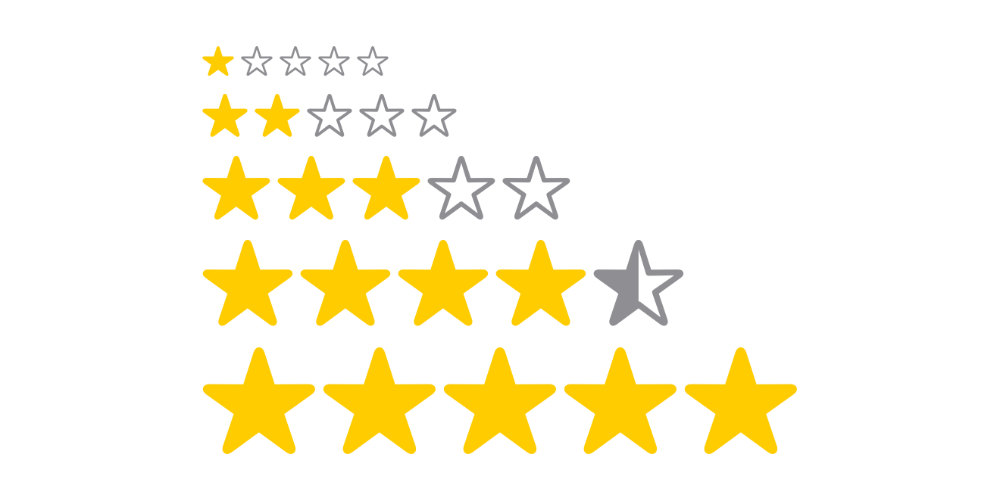</td></tr><table/>


## DSRadioPickerView

`DSRadioPickerView` is a SwiftUI component designed to offer a customizable radio button selection interface within the DSKit framework. It allows users to select a single option from a list of available options, making it ideal for forms, surveys, and settings.

#### Initialization:
Initializes a `DSRadioPickerView` with data and custom content rendering options.
- Parameters:
- `data`: The collection of data items.
- `id`: KeyPath to the unique identifier for each data item.
- `selected`: A `Binding` to the currently selected data element.
- `content`: Closure that generates a view for each item, provided with selection status.

#### Interaction:
- Tapping an item updates the selection state, accompanied by haptic feedback to enhance user interaction.

#### Usage:
`DSRadioPickerView` is suitable for scenarios where users need to make a single selection from multiple options, such as choosing a color, selecting a configuration option, or setting preferences.
#### Code example:
Here is how you might set up it within your views:
```swift
struct Testable_DSRadioPickerView: View {
    let data = ["Red","Orange","Purple","Green","Blue"]
    @State var selected = "Purple"
    var body: some View {
        DSRadioPickerView(data: data, id: \.self, selected: $selected, content: { element, _ in
            DSText(element).dsTextStyle(.smallHeadline)
        })
    }
}
```
Code example result:

<table><tr><td>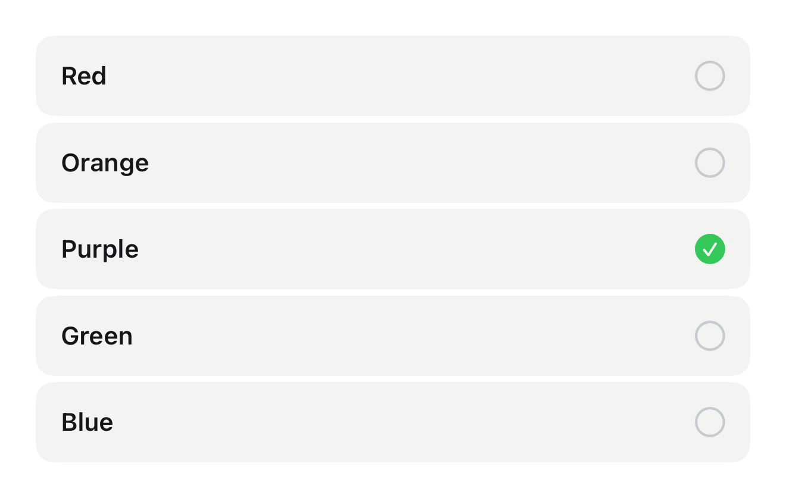</td></tr><table/>


## DSQuantityPicker

`DSQuantityPicker` is a SwiftUI component within the DSKit framework designed for interactive quantity selection in user interfaces, typically used in e-commerce applications or any setting where users need to specify a number of items.

#### Initialization:
Initializes a `DSQuantityPicker` with an optional initial quantity.
- Parameters:
- `quantity`: The initial quantity, defaulting to 1 if not specified.

#### Interaction:
- The decrement button is only active when the quantity is greater than 1, visually indicated by reduced saturation and opacity.
- Both increment and decrement buttons utilize haptic feedback to enhance the tactile response of the interface.

#### Usage:
`DSQuantityPicker` can be easily integrated into shopping carts, booking forms, or any interface where item count adjustments are necessary.

#### Code example:
Here is how you might set up it within your views:
```swift
struct Testable_DSQuantityPicker: View {
    var body: some View {
        DSQuantityPicker()
    }
}
```
Code example result:

<table><tr><td>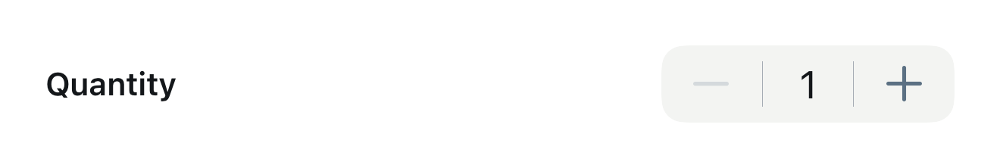</td></tr><table/>


## DSPickerView

`DSPickerView` is a versatile SwiftUI component within the DSKit framework, designed to present selectable content in various styles such as a horizontal scroll or a grid. It offers a dynamic way to select items from a collection, adapting to different content layouts based on user preferences or UI requirements.

#### Styles:
The `Style` enum defines how the items are presented:
- `horizontalScroll`: Items are displayed in a horizontally scrolling list.
- `grid(columns: Int)`: Items are arranged in a grid with a specified number of columns.

#### Initialization:
Initializes a `DSPickerView` with customization options for layout and interaction.
- Parameters:
- `style`: The visual layout style of the picker.
- `data`: The collection of data items.
- `id`: KeyPath to the unique identifier for each data item.
- `selected`: A `Binding` to the currently selected data element.
- `content`: Closure that generates a view for each item.

#### Usage:
`DSPickerView` is ideal for applications requiring user selection from a set of options displayed either in a line or a matrix.
#### Code example:
Here is how you might set up it within your views:
```swift
struct Testable_DSPickerView: View {
    
    let letters = ["A","B","C","D","E"]
    @State var selectedLetter = "A"
    
    let numbers = ["1","2","3","4","5","6","7","8","9"]
    @State var selectedNumber = "2"
    
    var body: some View {
        DSVStack {
            DSPickerView(
                data: letters,
                id: \.self,
                selected: $selectedLetter,
                content: { element in
                    DSText(element)
                        .dsSize(20)
                        .dsCardStyle()
                }
            ).dsSectionStyle(title: "Letters")
            
            DSPickerView(
                style: .grid(columns: 5),
                data: numbers, id: \.self,
                selected: $selectedNumber,
                content: { element in
                    DSText(element)
                        .frame(maxWidth: .infinity)
                        .dsCardStyle()
                }
            ).dsSectionStyle(title: "Numbers")
        }
    }
}
```
Code example result:

<table><tr><td>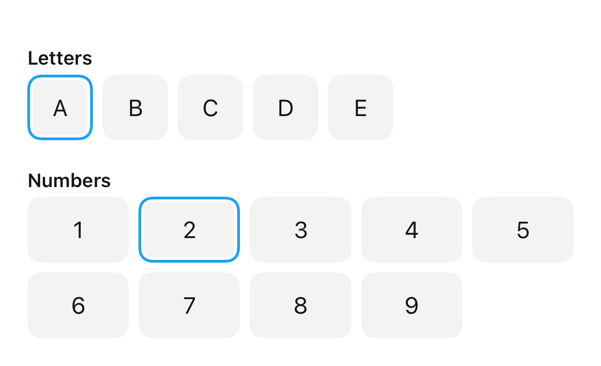</td></tr><table/>


## DSBottomContainer

`DSBottomContainer` is component designed to display content at the bottom of the screen, commonly used for adding buttons or contextual information to forms and dialogs. It enhances the display by adding a top shadow and managing spacing, ensuring that the content is both visually appealing and functionally positioned.

#### Initializer:
Initializes a `DSBottomContainer` with a view builder closure that defines its content.
- Parameters:
- `content`: A closure returning the content of the container. This closure is marked with `@ViewBuilder` to allow for multiple views to be composed together.

#### Usage:
`DSBottomContainer` is typically used to anchor controls or information at the bottom of the interface, adding visual structure and focus to bottom-placed elements.
#### Code example:
Here is how you might set up it within your views:
```swift
struct Testable_DSBottomContainer: View {
    var body: some View {
        DSVStack {
            DSText("Are you sure?")
        }
        .safeAreaInset(edge: .bottom) {
            DSBottomContainer {
                DSText("Save your changes")
                DSButton(title: "Submit", action: {})
            }.dsScreen()
        }
        .dsScreen()
    }
}
```
Code example result:

<table><tr><td>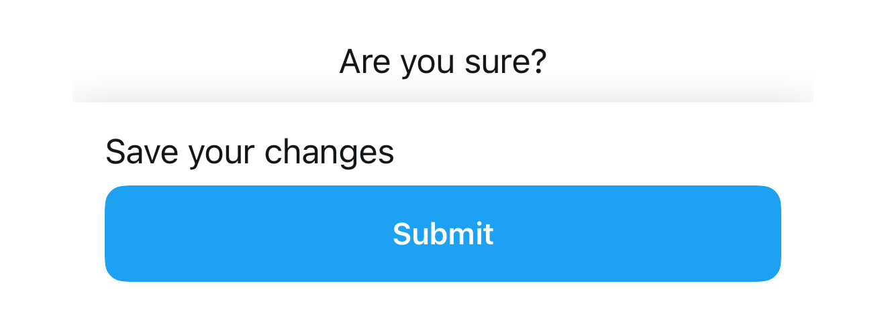</td></tr><table/>


## DSDivider

 `DSDivider` is a simple, design-aware component within the DSKit framework that renders a visual separation line between UI elements. It conforms to the design system's aesthetics, adapting its appearance based on environmental settings.

#### Initialization:
The `DSDivider` is initialized without parameters, defaulting to predefined styling that respects the current theme and spacing conventions.

#### Usage:
`DSDivider` is used to visually separate content within a view, often between list items, sections in a form, or alongside layout changes.
#### Code example:
Here is how you might set up it within your views:
```swift
struct Testable_DSDivider: View {
    var body: some View {
        DSDivider()
    }
}
```
Code example result:

<table><tr><td>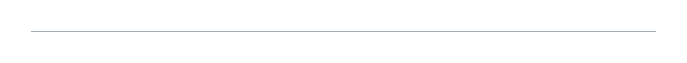</td></tr><table/>


## DSTextField

`DSTextField` is a customizable SwiftUI component within the DSKit framework designed to handle user input, integrating essential functionalities such as security, validation, and appearance customization. It supports text input, secure entry for passwords, and validation based on various criteria.

#### Initialization:
Initializes a `DSTextField` with various options for handling different types of input and validation.
- Parameters:
- `name`: The name of the SF Symbol to display within the text field.
- `size`: The size of the symbol icon within the text field.

#### Usage:
`DSTextField` is suitable for forms, login screens, and any interface where user input is required. The secure entry option and input validation make it particularly useful for handling sensitive information.
#### Code example:
Here is how you might set up it within your views:
```swift
struct Testable_DSTextField: View {
    
    @State private var name = DSTextFieldValue()
    @State private var email = DSTextFieldValue()
    @State private var phone = DSTextFieldValue()
    @State private var password = DSTextFieldValue()
    @State private var repeatPassword = DSTextFieldValue()
    
    var body: some View {
        ScrollView {
            DSVStack {
                DSVStack {
                    DSTextField.name(value: name)
                    DSTextField.phone(value: phone)
                    DSTextField.email(value: email)
                }
                .dsPadding()
                .dsSecondaryBackground()
                .dsCornerRadius()
                
                DSTextField.password(value: password)
                
                DSButton(title: "Subbmit") {
                    for element in [email, password, phone] {
                        let isValid = element.validate()
                        if !isValid {
                            break
                        }
                    }
                }
            }
        }
    }
}
```
Code example result:

<table><tr><td>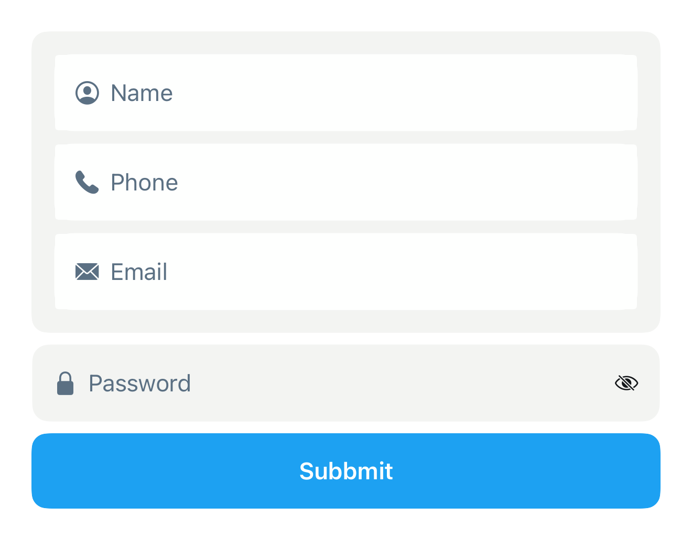</td></tr><table/>


## DSChevronView

`DSChevronView` is a simple, reusable view component within the DSKit framework designed to display a chevron icon. This component is typically used to indicate navigation or the ability to disclose more information, commonly found in list items or collapsible sections.

#### Initialization:
The `DSChevronView` is initialized without any parameters, defaulting to a predefined configuration:
- Initializes with a default system image named "chevron.right".

#### Usage:
`DSChevronView` is straightforward to use in various UI components where a visual indication for navigation or expansion is required.
#### Code example:
Here is how you might set up it within your views:
```swift
struct Testable_DSChevronView: View {
    var body: some View {
        DSChevronView()
    }
}
```
Code example result:

<table><tr><td></td></tr><table/>


## DSToolbarSFSymbolButton

`DSToolbarSFSymbolButton` is a SwiftUI component within the DSKit framework designed specifically for toolbars. It utilizes SF Symbols to provide a standard and visually consistent icon-based button, suitable for use in navigation bars, toolbars, or any interface requiring icon buttons.

#### Initialization:
Initializes a `DSToolbarSFSymbolButton` with the SF Symbol name.
- Parameters:
- `name`: The SF Symbol name to use for the button icon, reflecting the button's function or action.

#### Usage:
`DSToolbarSFSymbolButton` is ideal for applications requiring accessible, touch-friendly icon buttons in a toolbar. This component is particularly effective in contexts where space is limited, and icons convey actions more efficiently than text.
#### Code example:
Here is how you might set up it within your views:
```swift
struct Testable_DSToolbarSFSymbolButton: View {
    var body: some View {
        DSToolbarSFSymbolButton(name: "shippingbox")
    }
}
```
Code example result:

<table><tr><td></td></tr><table/>


## DSSectionHeaderView

`DSSectionHeaderView` is a SwiftUI component within the DSKit framework designed to provide a standard header for sections in interfaces. It typically includes a title and an actionable button, often used in list views, dashboards, or as part of more complex layouts where sections need clear labels and optional actions.

#### Initialization:
Initializes a `DSSectionHeaderView` with a title, action title, and a closure for handling button taps.
- Parameters:
- `title`: The text to display as the section header.
- `actionTitle`: The text for the action button.
- `action`: The closure to execute when the action button is tapped.

#### Usage:
`DSSectionHeaderView` is ideally used at the top of sections where a clear distinction and optional user interaction are needed, such as in settings menus, content lists, or information panels.
#### Code example:
Here is how you might set up it within your views:
```swift
struct Testable_DSSectionHeaderView: View {
    var body: some View {
        DSSectionHeaderView(
            title: "Top Products",
            actionTitle: "View All",
            action: { }
        )
    }
}
```
Code example result:

<table><tr><td></td></tr><table/>


