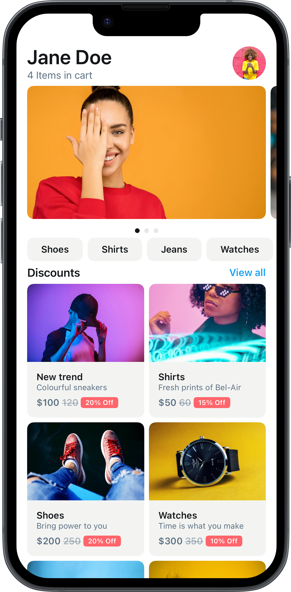
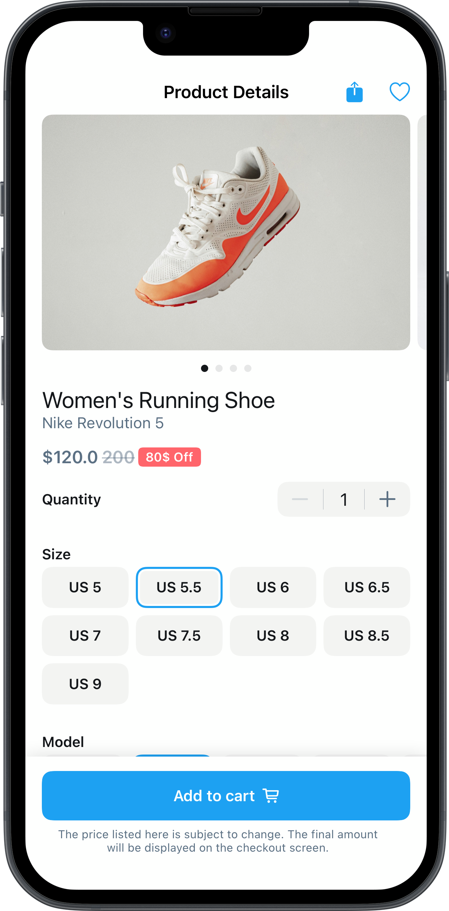
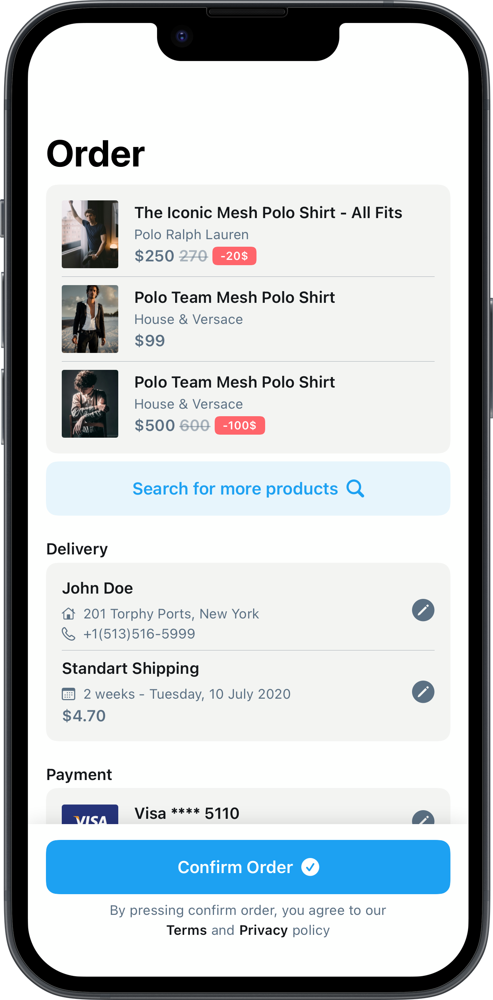
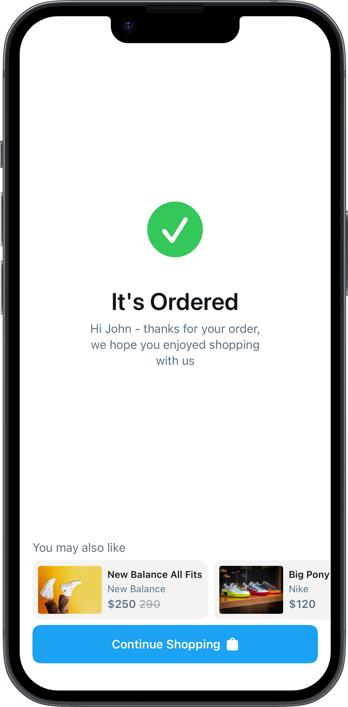

<p align="center">
    
</p>
<p align="center">
    
    
    <a href="https://swift.org/package-manager">
        
    </a>
</p>


# What is DSKit?

DSKit is a simple **Design System** SDK for **iOS 15+ SwiftUI**, designed to help developers create simple, consistent and attractive user interfaces with ease. It includes essential view modifiers which ensure that all UI components follow a unified style guide. 

## Components and Layouts

DSKit offers a library of ready-to-use UI components and full-screen layouts that are designed to be easily integrated and customized within your projects. Each component and screen layout is fully adaptable, allowing you to tweak and refine them to perfectly fit the specific needs of your application. This accessibility accelerates the development process, enabling you to implement complex design solutions efficiently while maintaining a high standard of aesthetics and functionality.

<table>
<tr>
<td><a href="DSKitExplorer/Screens/HomeScreen3.swift"></a></td>
<td><a href="DSKitExplorer/Screens/ItemDetails2.swift"></a></td>
<td><a href="DSKitExplorer/Screens/Order1.swift"></a></td>
<td><a href="DSKitExplorer/Screens/Order4.swift"></a></td>
</tr>
</table>
<p align="center"><b>Note:</b> Click on images to see the source code or <a href="ScreensGallery.md">here</a> to see all available layouts</p>

## Play and Prototype

DSKit features an **DSKitExplorer** app where you can experiment and prototype your screen designs. Choose from a variety of pre-built layouts to modify and expand as needed. Easily toggle between light and dark modes to see your designs in different settings. This interactive platform is the simplest way to familiarize yourself with DSKit's components, understand their functionality, and learn how to effectively apply them in your projects.


## Get started 

To get started with DSKit, a design system toolkit for SwiftUI applications, you can integrate it into your projects using Swift Package Manager (SPM), which is Apple’s dependency manager for Swift projects. Below is a step-by-step guide on how to add DSKit to your project and begin using it to enhance your UI development.

### Step 1: Adding DSKit via Swift Package Manager (SPM)
To add DSKit to your project, follow these steps:

1. **Open your Xcode project**: Launch Xcode and open the project where you want to include DSKit.

2. **Add the package dependency**:
   - Go to `File` > `Swift Packages` > `Add Package Dependency...`
   - Enter the repository URL for DSKit (you'll need to obtain this from the DSKit GitHub repository or the provider).
   - Select the version of the package you wish to add. You can choose a specific release or the latest commit.
   - Xcode will download the package and ask which of your project's targets to add it to. Select the target where you want to use DSKit.

### Step 2: Importing DSKit
Once DSKit is added to your project, you can start using it by importing the package at the top of your Swift files where you want to use the design system components:

```swift
import DSKit
```

### Step 3: Using DSKit in Your Screens
To integrate DSKit components and modifiers into your SwiftUI views, simply use them like any other SwiftUI component or modifier. Here’s an example of how you might use DSKit:

```swift
import SwiftUI
import DSKit

struct ContentView: View {
    var body: some View {
        DSVStack {
            DSText("Welcome to DSKit")
                .dsPadding()
                .dsBackground(.primary)
            DSText("Design with ease")
                .dsPadding()
                .dsBackground(.secondary)
        }
        .dsPadding()
    }
}
```

In this example, `DSVStack`, `DSText`, and various modifiers like `dsPadding()` and `dsBackground()` are used. These components and modifiers are part of DSKit and help apply consistent styling and spacing as defined in your design system.

### Step 4: Customizing DSKit
DSKit is designed to be flexible and can be customized to fit the specific needs of your project. You can modify existing components or add new ones in accordance with your design guidelines.


## Idea

The idea revolves around the design problem for mobile applications, in the company I worked for, there has always been the design problem, namely that designers make beautiful interfaces, only that they are not practical, difficult to implement.

In the business segment, small business, not all the time, there are enough resources, time and knowledge to generate content exclusively for mobile applications, pictures, illustrations, icons and perfect texts. The design that looks perfect at first, become problematic, the real content does not fit, the images are not so perfect, the buttons are not in place, and so on.

This is the first reason, I started working on DSKit, it is a tool, with the help of which it is possible to quickly create new interfaces, in which the typography, spaces, colors will be consistent in all the application screens.

The second reason is that there are a lot of applications, for online appointments, shopping, delivery, that work, but have an ugly design (in my opinion), and all because the business does not have the resources to hire a company or a designer to develop a special design. for their business.

Unlike Material Design, Flutter and other, design systems, that are overwhelmingly complicated, DSKit should be focused on fast delivery, with the most useful and simple components, and a lot of code examples, for different use cases.

DSKit will not, (and should not) cover everything, but if it fits the business requirements it should deliver flawless functionality. It should be the easiest way to make simple iOS applications and business white labels with a great, clean design and pixel-perfect UI.


## Contributions and support

DSKit is developed completely in the open, and your contributions are more than welcome.

Before you start using DSKit in any of your projects, it’s highly recommended that you spend a few minutes familiarizing yourself with its documentation and internal implementation, so that you’ll be ready to tackle any issues or edge cases that you might encounter.

Since this is a very young project, it’s likely to have many limitations and missing features, which is something that can really only be discovered and addressed as more people start using it.

This project does not come with GitHub Issues-based support, and users are instead encouraged to become active participants in its continued development — by fixing any bugs that they encounter, or by improving the documentation wherever it’s found to be lacking.

If you wish to make a change, open a [Pull Request](https://github.com/imodeveloperlab/dskit/pulls) — even if it just contains a draft of the changes you’re planning, or a test that reproduces an issue — and we can discuss it further from there.

Hope you’ll enjoy using DSKit!
