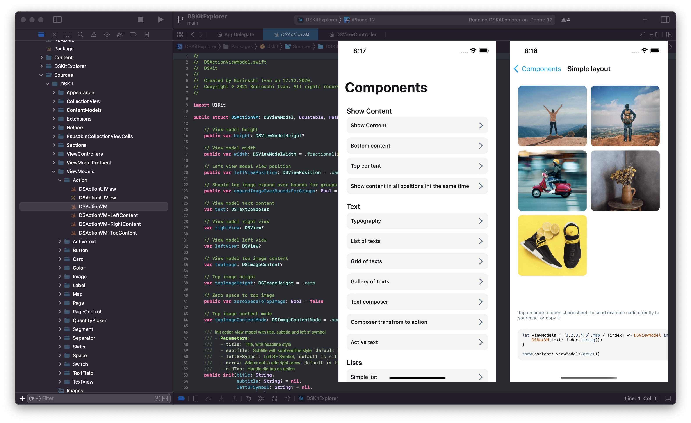

<p align="center">
    
</p>

<p align="center">
    
    <a href="https://swift.org/package-manager">
        
    </a>
    
    
</p>

Welcome to **DSKit** a Design System Kit for iOS 13+ is an iOS SDK written in Swift with a collection of reusable components, guided by clear standards, that can be assembled to build any number of applications.

[](https://circleci.com/gh/imodeveloperlab/dskit/tree/main)


# Why DSKit?

We can find a lot of design systems that can help you build any app you want. The problem is that they all are overwhelmingly complicated; this means there is a big learning curve from starting a new project to delivering it to the store.

DSKit will not cover everything, but if it fits your needs it will deliver flawless functionality. It’s the easiest way to make simple iOS Applications and business white labels with great design and Pixel Perfect UI.

#### All you have to do is:

* Chose your components
* Define the application flow
* Define colors, spacings, fonts, and further you don't care about spaces, layout, dimensions, etc.
* DSKit will take care of the rest.

<p align="center">
    
</p>

## Demo Projects

To get you started Design System Kit provides app demonstration code where you can see all the possibilities. You can even use this ready-made code for your next project.

* [E-commerce](https://github.com/imodeveloperlab/E-commerce)
* [Barbershop](https://github.com/imodeveloperlab/Barbershop)
* [Food Delivery](https://github.com/imodeveloperlab/Food-Delivery)
* [Flowers Store](https://github.com/imodeveloperlab/Flower-Store)

## Ducumentation

* [Code Example](https://dskit.app/home-code-example)
* [Components](https://dskit.app/components)
* [Layout](https://dskit.app/layout)
* [Appearance](https://dskit.app/appearance)

## Get Started !

To get started using DSKit you can download this git repo and build and explore the DSKit Explorer app, which will show all available components and guide you on how to get DSKit in your project.

<p align="center">
    
</p>

### Installation

DSKit is distributed using the [Swift Package Manager](https://swift.org/package-manager). 

To use DSKit within an iOS, then use Xcode’s `File > Add Packages...` menu command to add it to your project.

Then import DSKit wherever you’d like to use it:

```swift
import DSKit
```

For more information on how to use the Swift Package Manager, check out [this article](https://www.swiftbysundell.com/articles/managing-dependencies-using-the-swift-package-manager), or [its official documentation](https://swift.org/package-manager).


## Idea

My idea revolves around the design problem for mobile applications, in the company I worked for, there has always been the design problem, namely that designers make beautiful interfaces, only that they are not practical, difficult to implement.

In the business segment, small business, not all the time, there are enough resources, time and knowledge to generate content exclusively for mobile applications, pictures, illustrations, icons and perfect texts. The design that looks perfect at first, become problematic, the real content does not fit, the images are not so perfect, the buttons are not in place, and so on.

This is the first reason, I started working on DSKit, it is a tool, with the help of which it is possible to quickly create new interfaces, in which the typography, spaces, colors will be consistent in all the application screens.

The second reason is that there are a lot of applications, for online appointments, shopping, delivery, that work, but have an ugly design (in my opinion), and all because the business does not have the resources to hire a company or a designer to develop a special design. for their business.

Unlike Material Design, Flutter and other, design systems, that are overwhelmingly complicated, DSKit should be focused on fast delivery, with the most useful and simple components, and a lot of code examples, for different use cases.

DSKit will not, (and should not) cover everything, but if it fits the business requirements it should deliver flawless functionality. It should be the easiest way to make simple iOS applications and business white labels with a great, clean design and pixel-perfect UI.

## Contributions and support

DSKit is developed completely in the open, and your contributions are more than welcome.

Before you start using DSKit in any of your projects, it’s highly recommended that you spend a few minutes familiarizing yourself with its documentation and internal implementation, so that you’ll be ready to tackle any issues or edge cases that you might encounter.

Since this is a very young project, it’s likely to have many limitations and missing features, which is something that can really only be discovered and addressed as more people start using it.

This project does not come with GitHub Issues-based support, and users are instead encouraged to become active participants in its continued development — by fixing any bugs that they encounter, or by improving the documentation wherever it’s found to be lacking.

If you wish to make a change, open a Pull Request — even if it just contains a draft of the changes you’re planning, or a test that reproduces an issue — and we can discuss it further from there.

Hope you’ll enjoy using DSKit!
