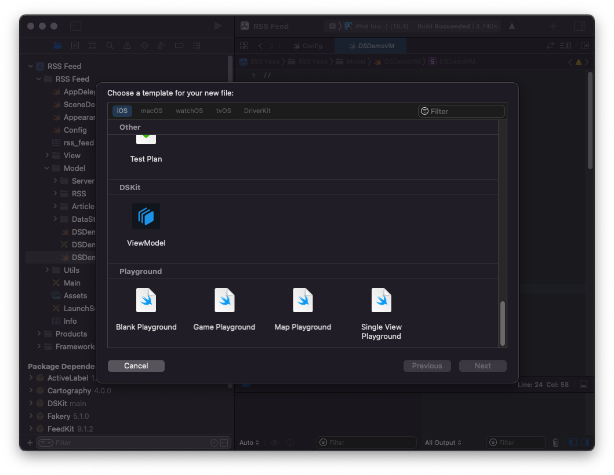

# Custom DSKit view models

Using `DSKit` you can add and display your own custom view models.
A view model is composed of two files, the ViewModel struct which should conform to `DSViewModel`, `Equatable`, `Hashable` protocols, and the View class which is a subclass of `UIView` and should implement the `DSReusableUIView` protocol.

## Template

The easiest way to create new view models with everything you need to be configured is to use ready to use XCode template.

It can be installed in two ways:
1. Manually copy `ViewModel.xctemplate`from `dskit/Templates/ViewModelTemplates` to `Xcode.app/Contents/Developer/Library/Xcode/Templates/File Templates`
2. Run script from terminal, open `/dskit/Templates/ViewModelTemplates`in terminal and run `sudo sh install.sh`

<p align="center">
    
</p>

## View Model

```swift 

//
//  DSDemoVM.swift
//  RSS Feed
//
//  Created by Ivan Borinschi on 11.04.2022.
//  
//

import UIKit
import DSKit

public struct DSDemoVM: DSViewModel, Equatable, Hashable {
    
    // ADD YOUR PROPERTIES HERE
    
    // Properties
    public init() {
    }
    
    // View Model Height
    public var height: DSViewModelHeight = .absolute(100)
    
    // View model width
    public var width: DSViewModelWidth = .fractional(1.0)
        
    /// Style
    public var style: DSViewModelStyle = DSViewModelStyle()
    
    /// Supplementary items
    public var supplementaryItems: [DSSupplementaryView]?
    
    /// Side views
    public var bottomSideView: DSSideView?
    public var leftSideView: DSSideView?
    public var rightSideView: DSSideView?
    public var topSideView: DSSideView?
    
    // View model type
    public var type: DSDemoVMType = .default
    
    // Unique identifier, if identifier will not be uniq DSKit will generate one for you
    // but this may affect content diff animations
    public var identifier = "Demo"
    
    // Accessibility identifier
    public var accessibilityIdentifier = "Demo"
    
    // Handle did tap on this view model
    @NonEquatable public var didTap: ((DSViewModel) -> Void)?
    
    // Companion object
    @NonEquatable public var object: AnyObject?
}

public enum DSDemoVMType {
    case `default`
}

public extension DSDemoVM {
    
    /// Get view model width
    /// - Parameters:
    ///   - layoutEnvironment: NSCollectionLayoutEnvironment
    ///   - section: DSSection
    /// - Returns: DSViewModelWidth
    func width(_ layoutEnvironment: NSCollectionLayoutEnvironment?, section: DSSection) -> DSViewModelWidth {
        return width
    }
    
    /// Get view model height
    /// - Parameters:
    ///   - layoutEnvironment: NSCollectionLayoutEnvironment
    ///   - section: DSSection
    /// - Returns: DSViewModelHeight
    func height(_ layoutEnvironment: NSCollectionLayoutEnvironment?, section: DSSection) -> DSViewModelHeight {
        return height
    }
    
    /// Get UIView representation
    /// - Returns: DSReusableUIView
    func viewRepresentation() -> DSReusableUIView {
        return DSDemoUIView.instanceFromNib()
    }
    
    /// Is this view model equal to another
    /// - Parameter model: DSViewModel
    /// - Returns: Bool
    func isEqual(to model: DSViewModel) -> Bool {
        guard let model = model as? Self else { return false }
        return self == model
    }
    
    /// View model hash
    func hash() -> String {
        return hashValue.string()
    }
}

```

## View

```swift 

//
//  DSDemoUIView.swift
//  RSS Feed
//
//  Created by Ivan Borinschi on 11.04.2022.
//  
//

import UIKit
import DSKit

final class DSDemoUIView: UIView, DSReusableUIView {
    
    /// DSReusableUIView protocol
    public var view: UIView { self }
    
    /// Set up with view model is called each time when a copy of
    /// this uiview is prepared to be displayed on the screen
    /// - Parameter viewModel: DSViewModel
    public func setUpWith(viewModel: DSViewModel) {
        
        guard let viewModel = viewModel as? DSDemoVM else { return }
        update(viewModel: viewModel)
    }
    
    /// Update view with view model
    /// - Parameter viewModel: DSDemoVM
    func update(viewModel: DSDemoVM) {
        
        // DO YOUR WORK HERE
        // THIS IS A REUSABLE VIEW
        // THIS METHOD IS CALLED EVERY-TIME THIS VIEW IS DISPLAYED ON SCREEN
    }
    
    class func instanceFromNib() -> DSDemoUIView {
        let view: DSDemoUIView = initFromNib()
        return view
    }
}

```
